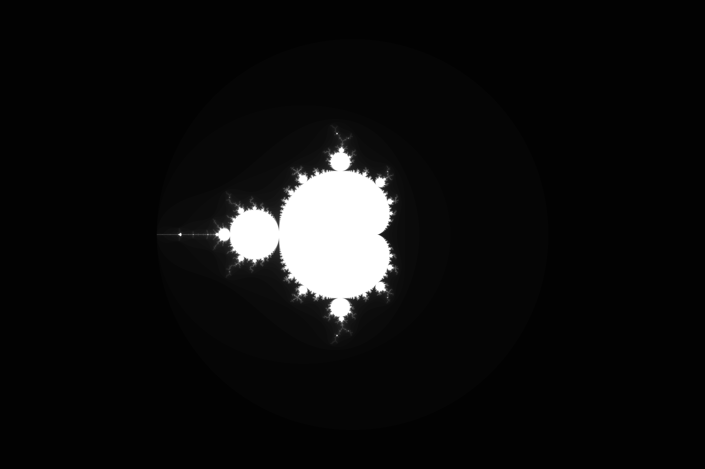

# Mandelbrot
The Mandelbrot set is a subset of the complex plane. Specifically, it consists of those those points $c$ for which the Julia set of $f(z) = z^2 + c$ is connected. While this is conceptually fairly abstract, the calculation is fairly straightforward.

# Example
Below is an example of a rendering of the Mandelbrot set, using this library:

# Implementation
This is a minimal implementation just to showcase the rendering of a Mandelbrot set. In the future, a color grade, or some kind of zooming capability could be added.
